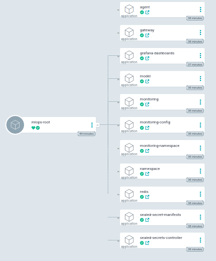
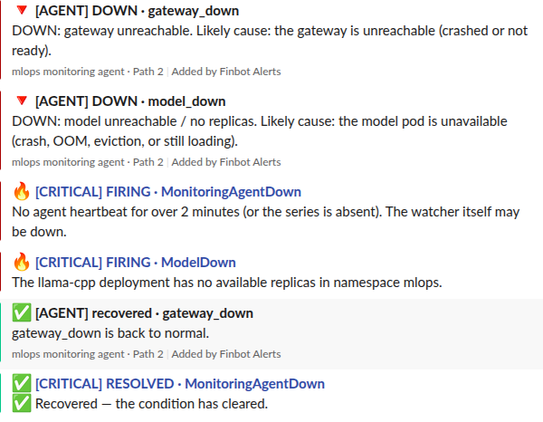
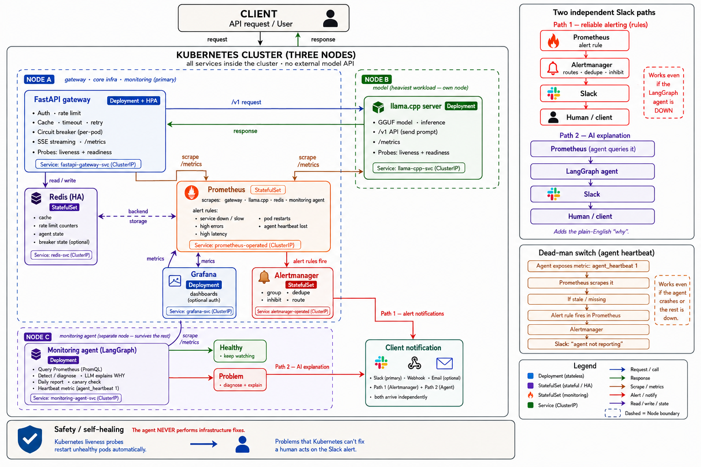
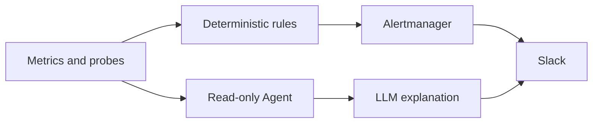
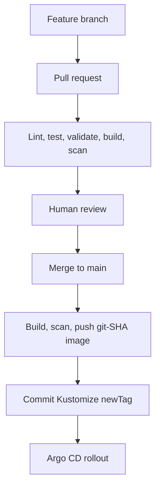

# FinBot MLOps Platform

[](https://github.com/vin-ML-dev/k8s-mlops-platform/actions/workflows/ci.yaml)
[](https://github.com/vin-ML-dev/k8s-mlops-platform/actions/workflows/release.yaml)

A production-style reference platform for serving a finance-focused GGUF language model on Kubernetes. It combines GitOps delivery, policy enforcement, resilient inference routing, encrypted secrets, observable model serving, deterministic alerting, and a read-only LLM-assisted incident explanation path.

The complete stack runs on a three-node local [kind](https://kind.sigs.k8s.io/) cluster. The local environment is deliberate: it demonstrates production patterns and failure modes without claiming that a laptop cluster is production infrastructure.

## What this project demonstrates

- **Declarative infrastructure:** Terraform provisions a reproducible three-node Kubernetes environment.
- **GitOps delivery:** Argo CD uses an App-of-Apps hierarchy, ordered sync waves, pruning, and self-healing.
- **Safe secret delivery:** only SealedSecret ciphertext is stored in Git; plaintext credentials stay outside the repository.
- **Resilient model access:** a FastAPI gateway provides authentication, validation, rate limiting, caching, timeouts, bounded retries, and a circuit breaker.
- **Observable inference:** Prometheus, Alertmanager, and Grafana cover traffic, errors, latency, saturation, cache behavior, workload health, and Agent heartbeat age.
- **Two independent incident paths:** Alertmanager provides deterministic rule-based notification; a read-only LangGraph Agent adds Kubernetes context and an LLM-generated explanation.
- **Controlled software delivery:** pull requests are linted, tested, rendered, schema-validated, built, and vulnerability-scanned before merge; releases publish immutable `git-<sha>` image tags.
- **Explicit safety boundaries:** rules detect, the LLM explains, humans decide, and GitOps applies planned changes.

## Runtime evidence

### GitOps application hierarchy



Argo CD manages the platform through the `mlops-root` Application and its component Applications. The captured state shows the complete hierarchy synchronized and healthy.


### Dual-path incident notification



Path 1 delivers Prometheus/Alertmanager firing and resolved notifications. Path 2 independently reports Agent classifications and explanations. The dead-man rule continues working when the Agent itself is unavailable.

## Architecture



### Workload placement

| kind node | Label | Scheduling policy | Primary workloads |
| --- | --- | --- | --- |
| `mlops-control-plane` | `node-role=infra` | Control-plane taint removed | Argo CD, gateway, Redis, monitoring |
| `mlops-worker` | `node-role=model` | `dedicated=model:NoSchedule` | llama.cpp and the GGUF model |
| `mlops-worker2` | `node-role=agent` | `dedicated=agent:NoSchedule` | LangGraph monitoring Agent |

The nodes are Docker containers on one machine, so this provides real Kubernetes scheduling behavior—not physical host or failure-domain isolation.

## Request and incident flows

### Inference request

```text
client
  -> Bearer authentication
  -> rate limit
  -> request validation
  -> Redis cache lookup
  -> circuit breaker + bounded retry
  -> llama.cpp inference
  -> cache response
  -> client
```

Redis is an optional dependency in the serving path. If it is unavailable, the gateway skips caching and rate limiting and continues attempting inference. This preserves availability at the cost of temporarily losing those two controls.

### Incident handling



- **Path 1 — detection and paging:** Prometheus evaluates fixed rules; Alertmanager groups, deduplicates, routes, and sends firing/resolved Slack notifications.
- **Path 2 — contextual explanation:** the Agent queries Prometheus, probes services, reads permitted pod status, previous container logs, and warning events, then asks a configurable LLM to summarize the evidence.
- **Dead-man monitoring:** `MonitoringAgentDown` fires when `monitoring_agent_heartbeat_timestamp_seconds` is stale for more than 120 seconds or the series disappears, followed by the rule's one-minute `for` window.

The Agent cannot create, update, patch, or delete platform resources. Its only writes are narrowly scoped incident state in Redis and outbound notifications.

## Technology stack

| Area | Implementation |
| --- | --- |
| Local infrastructure | Terraform `>= 1.5`, kind, Kubernetes `v1.30.0` node image |
| GitOps | Argo CD, App-of-Apps, AppProject policy, sync waves |
| Packaging | Kubernetes YAML, Kustomize, Helm multi-source Application |
| Secrets | Bitnami Sealed Secrets `v0.27.1` |
| Model serving | llama.cpp server, Qwen3 1.7B GGUF, OpenAI-compatible API |
| Gateway | Python 3.12, FastAPI, HTTPX, Prometheus client |
| Shared state | Redis 7.2, append-only persistence, PVC |
| Monitoring | kube-prometheus-stack `62.7.0`, Prometheus Operator, Alertmanager, Grafana |
| Agent | LangGraph, deterministic classification, configurable OpenAI/Ollama/template explanation backend |
| Delivery | GitHub Actions, Ruff, pytest, Kustomize, kubeconform, Trivy, Docker Hub |

## Components

| # | Component | Responsibility |
| ---: | --- | --- |
| 0 | Cluster | Terraform-managed three-node kind cluster, labels, taints, and local port mapping |
| 1 | Argo CD | GitOps bootstrap, AppProject boundaries, root Application, and `mlops` namespace |
| 2 | Sealed Secrets | Controller, CRD, encrypted secret manifests, examples, and sealing helper |
| 3 | Redis | Persistent shared state for cache, rate-limit counters, and Agent incident memory |
| 4 | Monitoring | Prometheus, Alertmanager, Grafana, exporters, and Slack routing via Helm |
| 5 | Model | Download-once GGUF storage, llama.cpp server, Service, probes, and metrics |
| 6 | Gateway | Inference policy, Redis integration, resilience, HPA, tests, and metrics |
| 7 | Agent | Deterministic monitoring, optional LLM explanation, read-only cluster context, and heartbeat |
| 8 | Monitoring config | Recording rules, availability/error alerts, and Agent dead-man switch |
| 9 | Grafana dashboards | Git-managed golden-signals dashboard provisioned through a labelled ConfigMap |
| 10 | CI/CD | Read-only PR validation and trusted post-merge image publishing/tag writeback |

### Argo CD child-application creation waves

| Wave | Applications |
| ---: | --- |
| `-1` | Platform namespace |
| `0` | Sealed Secrets controller, monitoring namespace |
| `1` | Sealed secret manifests, Redis, monitoring stack |
| `2` | Model server |
| `3` | Gateway |
| `4` | Monitoring Agent |
| `5` | Prometheus recording and alert rules |
| `6` | Grafana dashboards |

The waves order creation of the child `Application` resources during the root sync. Each child then reconciles its own source independently, so runtime readiness is still verified through Argo health and Kubernetes rollout status.

## Repository layout

```text
k8s-mlops-platform/
├── .github/workflows/
│   ├── ci.yaml                       # PR validation
│   └── release.yaml                  # post-merge publishing
├── argocd/
│   ├── apps/                         # child Applications
│   ├── bootstrap/                    # Argo installation + root Application
│   └── projects/                     # AppProject guardrails
├── deploy/base/
│   ├── namespace/
│   ├── sealed-secrets/
│   ├── redis/
│   ├── monitoring-namespace/
│   ├── model/
│   ├── gateway/
│   ├── agent/
│   ├── monitoring-config/
│   └── grafana-dashboards/
├── docs/images/                      # runtime evidence used by this README
├── helm/kube-prometheus-stack/       # local-kind Helm values
├── infra/
│   ├── kind/                         # reference/manual kind configuration
│   └── terraform/                    # authoritative cluster provisioning
├── secrets/
│   ├── examples/                     # safe plaintext shapes with placeholders
│   ├── sealed/                       # encrypted manifests safe for Git
│   └── seal-secret.sh
└── services/
    ├── gateway/                      # FastAPI service + tests
    └── agent/                        # LangGraph Agent + tests/configuration
```

## Prerequisites

- Linux or a Docker-capable workstation with at least **15 GB RAM** available to Docker
- Docker, kubectl, kind, and Terraform `>= 1.5`
- `kubeseal` compatible with the controller version
- Git and a GitHub repository readable by Argo CD
- Docker Hub repositories for `finbot-gateway` and `finbot-agent`
- A Slack incoming webhook
- An LLM API key only when the Agent's external LLM backend is enabled

The kind cluster is resource-intensive: the model alone requests 1.5 GiB and may take several minutes to download and initialize on its first start.

## Bootstrap from scratch

### 1. Clone the repository

```bash
git clone https://github.com/vin-ML-dev/k8s-mlops-platform.git
cd k8s-mlops-platform
```

If you fork the project, replace the repository URL in the Argo CD project and Application definitions before bootstrap, then commit that change to your fork. Argo CD reads Git—not uncommitted files on the workstation.

### 2. Provision the cluster

```bash
cd infra/terraform
terraform init
terraform apply
cd ../..
```

Apply workload isolation and make the local control-plane schedulable:

```bash
kubectl taint node mlops-worker dedicated=model:NoSchedule --overwrite
kubectl taint node mlops-worker2 dedicated=agent:NoSchedule --overwrite
kubectl taint node mlops-control-plane \
  node-role.kubernetes.io/control-plane- 2>/dev/null || true
```

Verify the cluster:

```bash
kubectl get nodes -L node-role
kubectl config current-context
```

### 3. Install metrics-server for the local HPA

kind does not include metrics-server:

```bash
kubectl apply -f \
  https://github.com/kubernetes-sigs/metrics-server/releases/latest/download/components.yaml

kubectl -n kube-system patch deployment metrics-server --type=json \
  -p='[{"op":"add","path":"/spec/template/spec/containers/0/args/-","value":"--kubelet-insecure-tls"}]'
```

`--kubelet-insecure-tls` is a local-kind accommodation and is not appropriate for production clusters.

### 4. Bootstrap Argo CD

```bash
chmod +x argocd/bootstrap/install.sh
./argocd/bootstrap/install.sh
```

The bootstrap script installs Argo CD, applies the `mlops` AppProject, and creates `mlops-root`. The root Application then discovers the child Applications under `argocd/apps/`.

```bash
kubectl -n argocd get pods
kubectl -n argocd get applications
```

### 5. Re-seal cluster-specific secrets

A new Sealed Secrets controller generates a new private key. Ciphertext created for another cluster cannot be decrypted by this one. Install `kubeseal`, then wait for the controller:

```bash
kubectl -n kube-system rollout status \
  deployment/sealed-secrets-controller --timeout=300s

chmod +x secrets/seal-secret.sh
```

Create plaintext working copies outside the repository and replace every placeholder:

```bash
cp secrets/examples/gateway-secret.example.yaml /tmp/gateway-secret.yaml
cp secrets/examples/model-secret.example.yaml /tmp/model-secret.yaml
cp secrets/examples/agent-secret.example.yaml /tmp/agent-secret.yaml
cp secrets/examples/alertmanager-slack.example.yaml /tmp/alertmanager-slack.yaml

${EDITOR:-nano} /tmp/gateway-secret.yaml
${EDITOR:-nano} /tmp/model-secret.yaml
${EDITOR:-nano} /tmp/agent-secret.yaml
${EDITOR:-nano} /tmp/alertmanager-slack.yaml
```

Seal each file and immediately remove the plaintext copies:

```bash
cd secrets
./seal-secret.sh /tmp/gateway-secret.yaml sealed/gateway-sealed.yaml
./seal-secret.sh /tmp/model-secret.yaml sealed/model-sealed.yaml
./seal-secret.sh /tmp/agent-secret.yaml sealed/agent-sealed.yaml
./seal-secret.sh /tmp/alertmanager-slack.yaml \
  sealed/alertmanager-slack-sealed.yaml
cd ..

rm /tmp/gateway-secret.yaml /tmp/model-secret.yaml \
  /tmp/agent-secret.yaml /tmp/alertmanager-slack.yaml
```

Ensure all four encrypted files are listed under `resources:` in `secrets/sealed/kustomization.yaml`. Commit **only** the sealed outputs:

```bash
git switch -c bootstrap/cluster-secrets
git add secrets/sealed/
git commit -m "chore: seal credentials for the current cluster"
git push -u origin bootstrap/cluster-secrets
```

Open a pull request, let CI pass, and merge it. A hard refresh is optional if immediate reconciliation is needed:

```bash
kubectl -n argocd patch application mlops-root --type merge \
  -p '{"metadata":{"annotations":{"argocd.argoproj.io/refresh":"hard"}}}'
```

Never commit plaintext Secrets. On a persistent production cluster, securely back up the Sealed Secrets recovery key rather than depending only on re-sealing.

### 6. Wait for reconciliation

The first model start downloads roughly 2 GB to the `model-cache` PVC and then loads the model:

Run these in separate terminals when following the first startup:

```bash
kubectl -n mlops logs -l app=llama-cpp -c fetch-model -f
```

```bash
kubectl -n mlops logs -l app=llama-cpp -c llama-cpp -f
```

Verify the final state:

```bash
kubectl -n argocd get applications \
  -o custom-columns='APP:.metadata.name,SYNC:.status.sync.status,HEALTH:.status.health.status'

kubectl -n mlops get pods -o wide
kubectl -n monitoring get pods
kubectl -n mlops get pvc
```

## Test the inference path

Load the gateway key without printing it:

```bash
export KEY="$(kubectl -n mlops get secret gateway-secret \
  -o jsonpath='{.data.GATEWAY_API_KEY}' | base64 --decode)"
```

Forward the gateway in one terminal:

```bash
kubectl -n mlops port-forward --address 127.0.0.1 \
  service/fastapi-gateway-svc 8000:8000
```

From another terminal:

```bash
curl http://127.0.0.1:8000/healthz
curl http://127.0.0.1:8000/readyz

curl http://127.0.0.1:8000/v1/chat/completions \
  -H "Authorization: Bearer $KEY" \
  -H 'Content-Type: application/json' \
  -d '{"messages":[{"role":"user","content":"What is compound interest?"}],"max_tokens":128}'
```

Repeat the completion request with `curl -i`; the second identical response should include `x-cache: HIT` while the cached entry remains valid.

## Access the operational UIs

Run each port-forward in a separate terminal:

| UI | Command | URL |
| --- | --- | --- |
| Argo CD | `kubectl -n argocd port-forward svc/argocd-server 8081:443` | `https://localhost:8081` |
| Prometheus | `kubectl -n monitoring port-forward svc/kps-prometheus 9090:9090` | `http://localhost:9090` |
| Alertmanager | `kubectl -n monitoring port-forward svc/kps-alertmanager 9093:9093` | `http://localhost:9093` |
| Grafana | `kubectl -n monitoring port-forward svc/kps-grafana 3000:80` | `http://localhost:3000` |

Retrieve the initial Argo CD password without storing it in Git:

```bash
kubectl -n argocd get secret argocd-initial-admin-secret \
  -o jsonpath='{.data.password}' | base64 --decode
echo
```

The committed Grafana password is intentionally local-only. Replace it with secret-backed authentication before using this stack outside an isolated development environment.

## Monitoring and alerts

| Alert | Condition | Hold time | Severity |
| --- | --- | ---: | --- |
| `ModelDown` | No available `llama-cpp` replica, including an absent metric | 2 minutes | Critical |
| `GatewayDown` | No available gateway replica, including an absent metric | 2 minutes | Critical |
| `GatewayDegraded` | Available gateway replicas below desired replicas | 5 minutes | Warning |
| `GatewayHighErrorRate` | Five-minute 5xx ratio above 10% | 5 minutes | Warning |
| `MonitoringAgentDown` | Agent heartbeat missing or stale for more than 120 seconds | 1 minute | Critical |

The quality canary remains implemented and unit-tested behind `canary.enabled`. It can be disabled without removing its code or tests. Canary failures are advisory and are separate from the deterministic availability/error alert path.

## CI/CD



### Pull-request validation (`ci.yaml`)

- Uses read-only repository permissions and no deployment secrets.
- Runs blocking Ruff checks and gateway/Agent unit tests.
- Renders every Kustomize base and validates schemas with kubeconform.
- Builds both service images without pushing them.
- Blocks on fixable High or Critical Trivy findings.

### Post-merge release (`release.yaml`)

- Runs only when gateway or Agent source files change on `main`.
- Rebuilds and scans only the changed service image.
- Publishes `vin1989/finbot-<service>:git-<12-character-sha>` to Docker Hub.
- Updates the matching Kustomize `newTag` and commits the desired version to Git.
- Requires no Kubernetes credentials; Argo CD observes Git and performs the rollout.

Repository setup requires `DOCKERHUB_USERNAME` and `DOCKERHUB_TOKEN` as GitHub Actions secrets. Protect `main` with required pull requests and required `ci` checks. If the release workflow writes tags directly to protected `main`, grant a narrowly scoped ruleset bypass to that workflow actor or change the writeback step to open a deployment pull request.

## Local validation

Run gateway tests:

```bash
cd services/gateway
python -m pytest tests/ -q
cd ../..
```

Run Agent tests—including canary scoring even when runtime canaries are disabled:

```bash
cd services/agent
python -m pytest tests/ -q
cd ../..
```

Render all Kustomize packages before committing manifest changes:

```bash
for directory in deploy/base/*/; do
  [ -f "$directory/kustomization.yaml" ] || continue
  kubectl kustomize "$directory" >/dev/null
done
```

## Security model

- Plaintext secrets are ignored by Git; only example shapes and SealedSecret ciphertext are committed.
- The AppProject restricts source repositories, destination namespaces, and permitted cluster-scoped resource kinds.
- The Agent uses a dedicated ServiceAccount with read-only Kubernetes permissions; write verbs are intentionally absent.
- CI pull-request validation has `contents: read`, no registry credentials, and no cluster credentials.
- Only the post-merge release workflow receives Docker Hub credentials and Git write permission.
- User-facing errors are normalized; gateway responses do not expose Python stack traces.
- Image vulnerability scanning blocks configured High and Critical findings before merge and publish.

Example permission verification:

```bash
kubectl auth can-i get pods/log \
  --as=system:serviceaccount:mlops:mlops-agent -n mlops

kubectl auth can-i list events \
  --as=system:serviceaccount:mlops:mlops-agent -n mlops

kubectl auth can-i delete pods \
  --as=system:serviceaccount:mlops:mlops-agent -n mlops
```

The expected answers are `yes`, `yes`, and `no`.

## Engineering decisions and trade-offs

### Why Redis is intentionally single-replica

Redis stores performance and coordination data—not the model or the authoritative deployment state. A Redis interruption removes caching and rate limiting temporarily, while the gateway continues forwarding inference requests. For this local platform, a persistent single replica is a better complexity trade-off than replication plus Sentinel. Production requirements may justify managed or HA Redis.

### Why the model uses `Recreate`

The GGUF is stored on a `ReadWriteOnce` PVC. `Recreate` prevents old and new model Pods on different nodes from competing for the same volume during rollout. This trades zero-downtime model upgrades for simple, predictable local storage semantics.

### Why alerting has two paths

The deterministic Alertmanager path remains available when the Agent or external LLM is down. The Agent path can add human-readable context but is not trusted as the sole detector. Availability does not depend on generative reasoning.

### Why releases update Git instead of the cluster

GitHub Actions builds and publishes artifacts but holds no kubeconfig. Updating `newTag` in Git preserves an auditable desired state; Argo CD is the deployment authority inside the cluster.

## Scope and known limitations

This repository is a strong local reference implementation, not a production-ready hosted service. Before production use:

- Replace kind with a managed or hardened multi-zone Kubernetes cluster.
- Replace local PVC assumptions with an appropriate storage class and establish backup/restore procedures.
- Pin the llama.cpp image by immutable digest; sign images and generate/verify SBOM attestations.
- Replace local Grafana credentials and Slack webhooks with an external secret-management and identity solution.
- Remove the local-only metrics-server insecure TLS flag.
- Add ingress, TLS, network policies, PodDisruptionBudgets, and explicit egress controls.
- Add persistent Prometheus storage, retention planning, SLOs, and remote-write if required.
- Align every Agent PromQL query with the gateway's exported metric contract and enforce that contract in tests.
- Filter Kubernetes events by incident object and timestamp before including them in LLM context.
- Add prompt/log redaction, LLM request auditing, and separate success/failure metrics for explanation calls.
- Evaluate HA Redis and multi-replica/GPU model serving against measured availability and throughput requirements.

## Teardown

```bash
cd infra/terraform
terraform destroy
```

Destroying and recreating the cluster also replaces the Sealed Secrets key. Re-seal the credentials before expecting the encrypted manifests to reconcile successfully in the new cluster.
